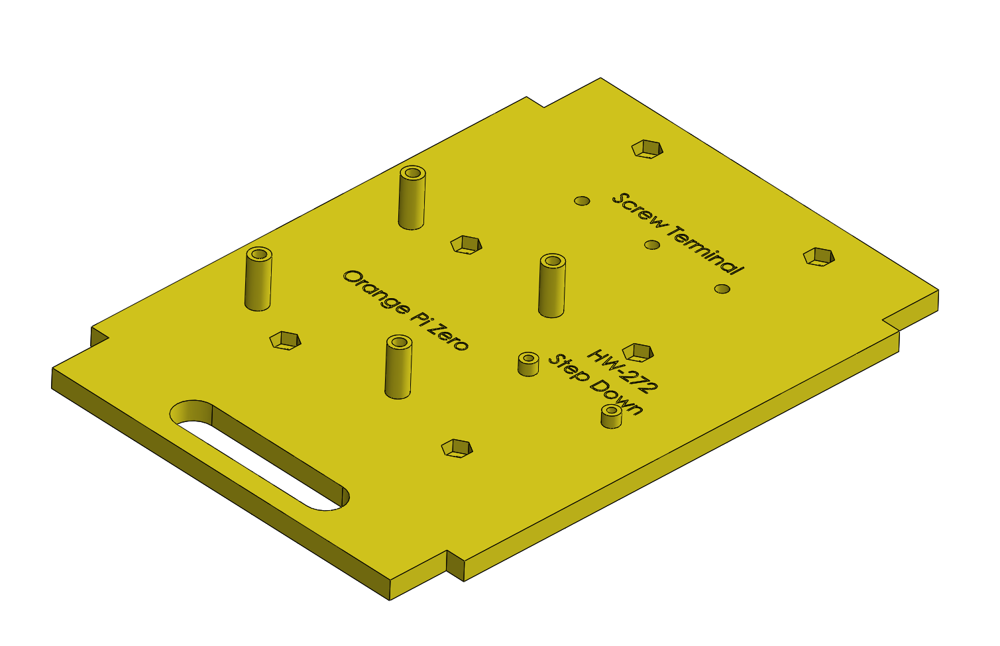
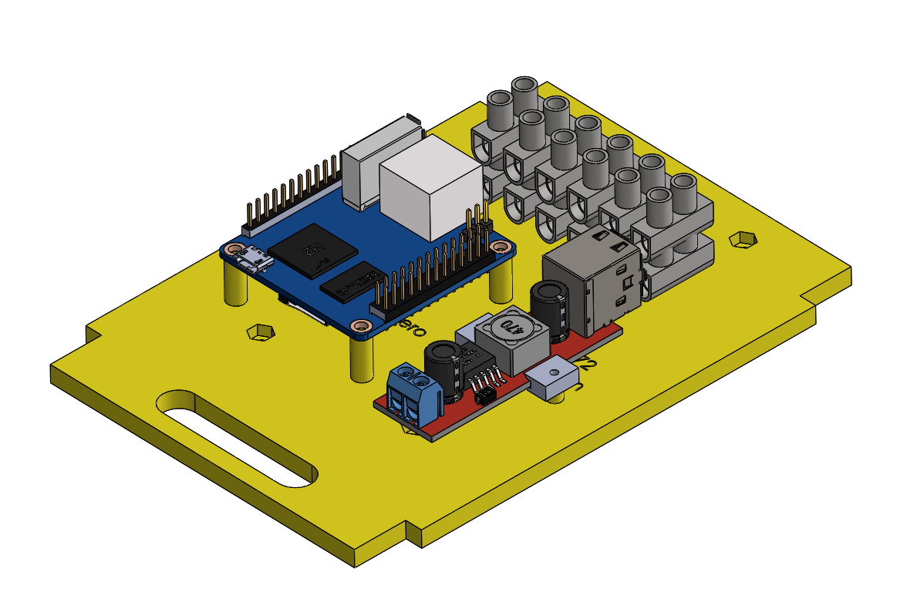

# Parts and Components

All the STL's that were used to build the robot are from the SpotMicroESP32 project of Michael Kubina and can be found here:
https://github.com/michaelkubina/SpotMicroESP32

The parts that were customized to house the Mirte hardware are all in this folder. They include a mounting plate for the OrangePi Zero, a 5 volt step-down converter and the screw terminals that were used to divide the current to the servo motors. Also a holder for the step-down converter was designed and adjustments were made to the battery holder to house the smaller 6.6 volt lipo battery that was used for this project.  

Below, a table with all components can be found, along with a price. 

| **Component** | **Unit Price** | **Quantity** | **Price** | 
| --- | --- | --- | --- |
| MG996R servomotor | €0.95 | 12 | €11.40 |
| Orange Pi Zero | €18.30 | 1 | €18.30 |
| STM32 Microcontroller | €3.28 | 1 | €3.28 |
| Micro SD Card (at least 16 GB)| €1.52 | 1 | €€1.52 |
| PLA for 3D print design | €18.00(€/kg) | 1 kg | €18.00 |
| Terminal blocks | €0.75 | 2 | €1.50 |
| USB step down converter | €0.79 | 1 | €0.79 |
| LiPo battery pack | €28.50 | 1 | €28.50 |
| XT60 cable | €6.60 | 1 | €6.60 |
| Pack of jumper cables | €1.79 | 1 | €1.79 |
| 4mm2 Electrical cable | €0.86 (€/m) | 0.30m | €0.26 |
| Toggle switch| €2.13 | 2 | €4.26 |
| M3 nuts | €1.35 | 1 | €1.35 |
| M2 nuts | €1.35 | 1 | €1.35 |
| M3x8 bolts | €2.05 | 2 | €4.10 |
| M3x20 bolts | €2.95 | 2 | €5.90 |
| M2x8 bolts | €2.75 | 2 | €5.50 |
| Ball bearing | €2.65 | 8 | €20.48 |
| **Total** | | | **€134.88** | 

