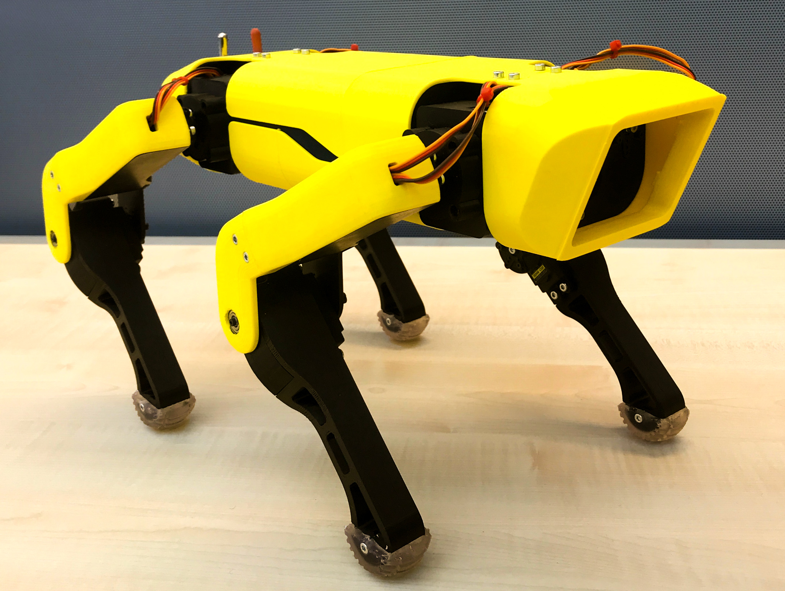

# SpotMicro
TU Delft - Mechanical Engineering (Cognitive Robotics) Bachelor's Thesis 

## Introduction
According to 'How robots change the world' by Oxford Economics, Robots could take over 20 million jobs by 2030. It is no longer a question of if robotics will shape our future, but how much and in what ways. This makes teaching young students about robotics all the more important. 

This is the bachelor thesis of four mechanical engineering students of the 3mE faculty at the Delft Technical University. This bachelor thesis was made under the supervision of MSc. Martin Klomp, ir. Ehsan Hosseini and ir. André van der Kraan of the Cognitive Robotics Department.

This report describes the design project called 'Building a low-cost ROS-based Quadruped SpotMicro Robot'. The Cognitive Robotics project has the aim to design a low-cost robot that uses components of the Mirte robot kit. Mirte is a robot developed for education, that includes hardware and software. Mirte was created with the idea that educational robots should be cheap, open source, focus on more than just software, have as few custom parts as possible and should be useful from primary/elementary school all the way to university. 
The Mirte components that are used in the Spotmicro robot are the OrangePi Zero and the STM32 MINI Controller. The software is a python api for ROS, making it possible to control robots from a python script. 

SpotMicro is an opensource robot which takes design elements from the famous spot robot by Boston Dynamics. There are a number of existing designs for the SpotMicro, of which we chose one. Therefore, the design challenge of this project is mostly in research in servo motor selection and the programing of the robot to make SpotMicro work with the Mirte components and software. 

The parts that were used to build the robot were all taken from the SpotMicroESP32 project of Michael Kubina and can be found here:
https://github.com/michaelkubina/SpotMicroESP32

In the simulations folder, the theoretical models for the predictions of the motor torque requirements can be found. All the forward kinametics for the robot control can be found in the code folder. All the STL's that were designed by us for the Mirte hardware can be found in the parts folder. 
