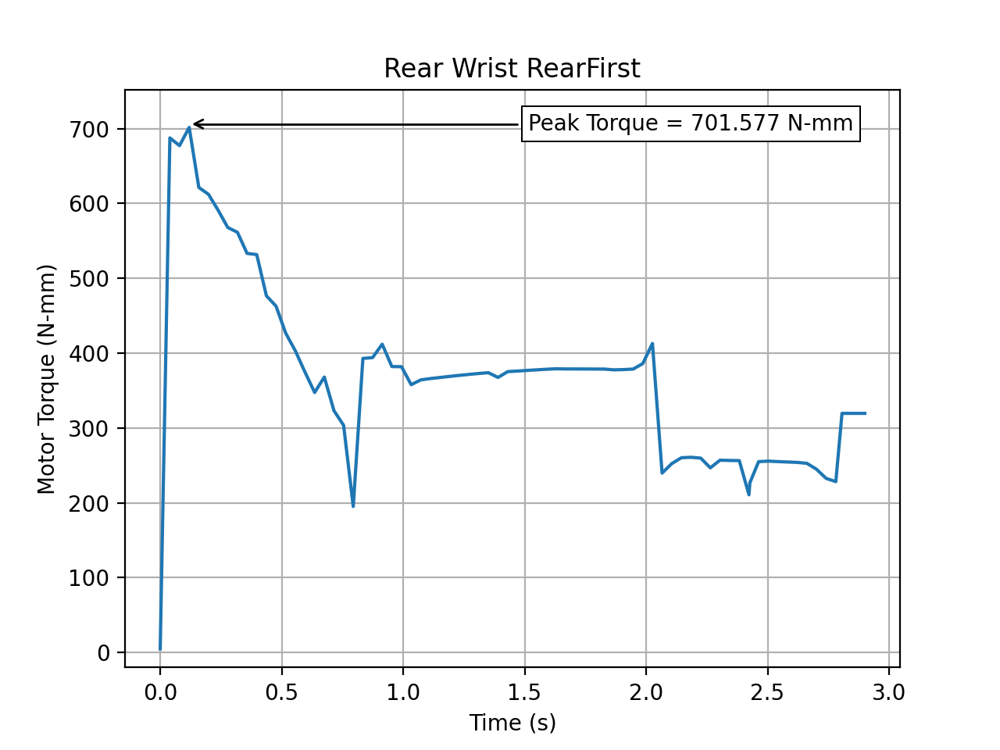
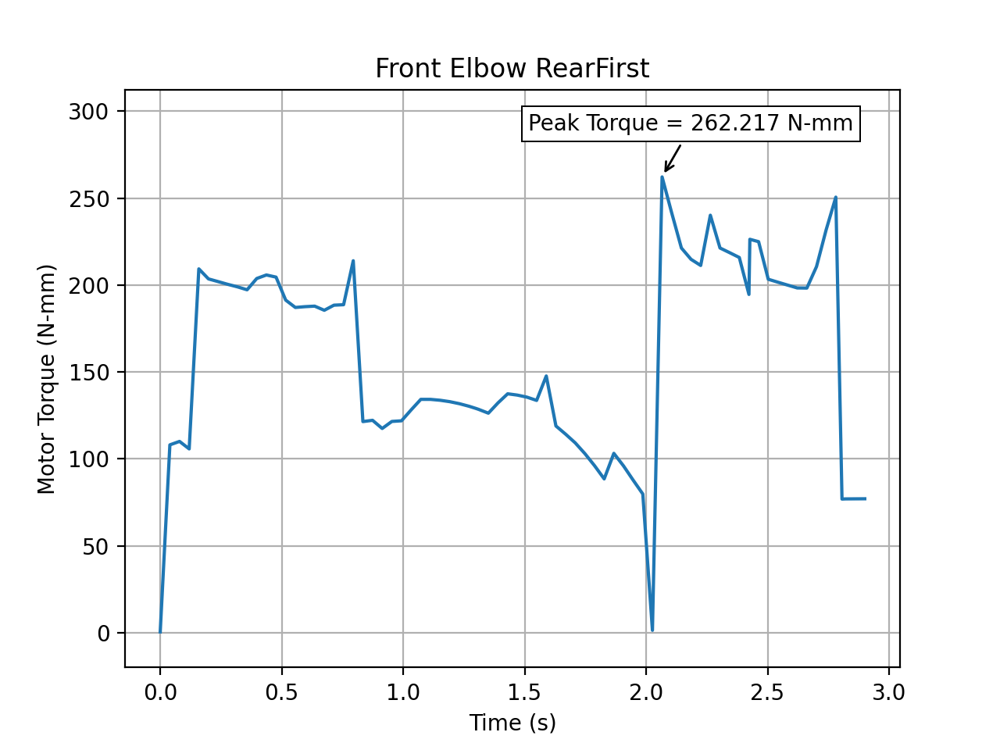

In order to predict the minimal required motor torque, multiple
theoretical models were be made. The first model was  a
motion study in Solidworks. Next, a dynamical kinematics
model was be made with the use of Python. From the findings
of the theoretical models, a motor selection was done and
implemented in an actual robot. And lastly, in order to validate
the models, a video analysis of the motion of the robot was
done with the use of Coach 7 and Python.

The SolidWorks motion study modeled the following movements and returned the torques that were deliverd by the motors in the joints. 
The results of this motion study are plotted in the graphs below. 

The peak in motor torque is 732 N-mm and witnessed in the wrists of the front legs of the robot.  

The peak in motor torque is 702 N-mm and witnessed in the wrists of the front legs of the robot.  

From these simulations it became clear that standing up with the rear legs first requires less torque from the motors. 

Next to the motion a study, a dynamical kinematics model was made with the help of a python script. This theoretical model will calculate the required torques based on two components: the force of gravity and the angular momentum of the servo motors. The model simulates the movement of the servomotors: it outputs the velocity and acceleration of the servomotors at their respective position and thus gives
an insight in the requirements the motors.
The code of this model can be found in the Code folder. 

After the robot was built, a video analysis of the motion of the robot was made to validate the theoretical models and to find a
conclusive answer to what the real torque is that is required to stand up. The validation is performed on the robot built with
the MG996R servo motors. Coach 7 was used to map out the x and y coordinates of the foot tip, wrist and elbow of the rear and front leg of the robot, a snapshot of this process can be seen below.

These coordinates are then imported in a python script that maps out the real angular position, velocity and acceleration of the servomotors. These real coordinates are then used to simulate the movement based on the real movements of the robot, which can be seen in the GIF format here below. It should be noted that because it is still assumed that the robot is symmetric over its longitudinal axis, a profile of the robot is taken.

